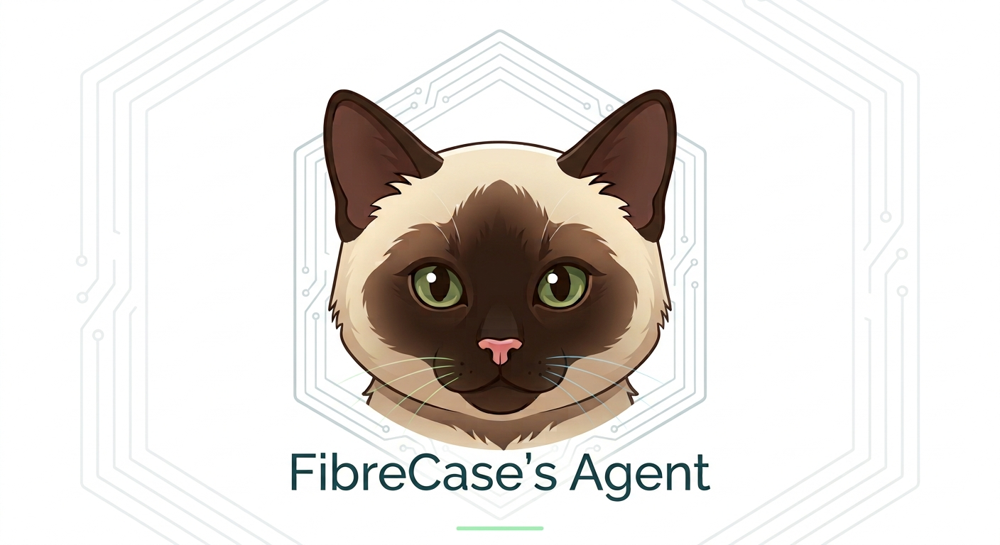

# FibreCase's Agent Backend



一个运行在你自己服务器上的**最小可用的个人 AI Agent Backend**：在 Telegram 里和一个基于 OpenAI 兼容模型的 Agent 对话，**对话历史持久化**——重启后上下文不丢失；Agent 可以调用少量安全的内置工具来回答问题，也支持**图片输入**（收到的图片持久化、重启后仍在上下文里作为图片交给模型），还能用 `/remember` **显式保存长期记忆**（账号隔离、跨 `/new` 与重启保留）。

> **重要：当前内置工具仅限只读/无害操作**：`get_current_time`（当前时间）、`echo`（回显）、`system_info`（主机名/平台/Python 版本）。
> 它**不能**执行命令、控制设备、读写文件、联网扫描。如果用户要求超出工具能力的操作，它会明确说明「当前尚未配置相应工具」。

## 架构

它不是「一个 Telegram chatbot」，而是从第一版就分层——Telegram 只是一层薄适配器，核心是**渠道无关**的 `AgentService`，工具循环插在核心和 LLM 客户端之间。未来接 Web UI / Discord / API 都复用同一个核心，**不改 Telegram 层**。

```
Telegram Adapter   →   Agent Service   →   Tool Loop   →   LLM Client   →   Persistent Conversation
（适配器）            （渠道无关的核心）    （工具循环）    （OpenAI 兼容）   （SQLite）
                                  ↑
                          Tool Registry（get_current_time / echo / system_info）
```

- 通过 **Telegram Bot**（long polling）对话；用 **OpenAI 兼容** LLM 生成回复。
- **工具调用 + 工具安全**：`allow`/`ask`/`deny` 策略 → JSON Schema 校验 → 需要时的一次性 Telegram 人工审批 → 单工具超时 → 只记元数据的 append-only 审计（`/tool_audit` 查看，绝不显示参数/结果）。
- **远程 MCP 工具（Streamable HTTP + stdio 本地进程）**：启动时发现 MCP 服务器（远程 Streamable HTTP 端点，或后端 spawn 的本地 stdio 子进程）的工具并注册进同一个 registry（`mcp_<server>__<remote>`、默认 `ask`），因此**完全复用**上面的工具安全边界——MCP 只是又一个工具 provider，`/mcp_status` 只读查看状态。
- **MCP 用户级 OAuth（per Telegram user）**：`/mcp auth <server>` 给**你**一个第三方 OAuth 登录按钮（首个实现：Google），凭据按 Telegram user 绑定、自动刷新 access token，后续 MCP 调用自动带上你自己的 token；`/new` 与重启都**不**影响登录状态。
- **图片输入 + 持久化**：照片（可带说明文字）base64 内联交给模型，并以内容寻址 blob 落盘（SHA-256 去重、原子写入），重启后仍在窗口内时重新入窗。
- **上下文预算管理**：消息数窗口之上再有一道模型无关的估算 token 预算，必要时把历史图片降级为纯文本，绝不让超长请求打爆端点。
- **显式长期记忆**：`/remember` 显式保存，纯词法检索，跨 `/new` 与重启保留，作为一条明确标注的参考消息注入（不是自动摘要、不是 RAG）。
- **Markdown 自动渲染**：模型回复的加粗/斜体/代码块/链接/标题转成 Telegram HTML 显示，无法解析时回退纯文本，回复永不丢失。
- 仅允许你配置的 Telegram User ID 使用，其他人静默拒绝。

## 快速开始

**要求**：Python 3.13+（已在 3.14 验证）、[uv](https://docs.astral.sh/uv/)、一个 OpenAI 兼容 LLM endpoint + key、一个 Telegram Bot token。无需装数据库——SQLite 文件启动时自动创建。

```bash
uv sync                 # 安装运行时 + 开发依赖到 .venv
cp .env.example .env    # 然后编辑 .env 填入真实值
uv run python -m fibrecase_agent_backend
```

- **创建 Bot 与拿到自己的 user id**：见 [Telegram 接入](docs/telegram.md)。
- **配置项全表**（`OPENAI_BASE_URL` 前缀规则、工具/预算/记忆/超时等所有变量）：见 [Configuration](docs/configuration.md)。
- **跑 Docker**：见 [Docker 部署](docs/deployment.md)。

看到日志 `telegram long polling started` 即就绪，发 `/start` 开始对话。

## 命令

| 命令 | 作用 |
| --- | --- |
| `/start` | 启动 Agent / 查看当前会话 |
| `/new` | 开始新会话，清空本 chat 历史（**不影响**长期记忆） |
| `/context` | 只读预览当前上下文窗口：消息数、估算 token 占用/剩余、历史图片保留/降级数 |
| `/remember <内容>` | 保存一条长期记忆到你的账号（跨 `/new` 与重启）；回显 ID |
| `/memories` | 列出你保存的所有记忆 |
| `/forget <id>` | 删除指定记忆；不存在或不属于你 → 未找到 |
| `/forget all CONFIRM` | 清空你账号下全部记忆（破坏性，必须带 `CONFIRM`） |
| `/status` | 查看运行状态（版本、模型、会话 id、消息数） |
| `/tool_audit [limit]` | 查看你本人的工具执行审计（只显工具名/事件/结果码/耗时） |
| `/mcp` | 只读查看 MCP 服务器状态，并显示**你本人**在各 OAuth 服务器上的登录状态 |
| `/mcp auth <server>` | 为你的账号发起第三方 OAuth 登录（如 `gcal` → Google 日历），返回一个**登录按钮**（无需复制 URL）；凭据绑定到你的 Telegram user，自动刷新 |
| `/mcp_status` | 只读查看已配置远程 MCP 服务器状态（available/unavailable、工具数、总数）；不发起连接、不显示 URL/token |
| `/help` | 列出帮助 |

其它任何文字消息都会作为对话发给 Agent。完整说明见 [Telegram 接入与命令](docs/telegram.md)。

## MCP 用户级 OAuth（phase 4.x）

给 MCP 服务器配上**用户级 OAuth** 后（如 Google 日历），凭据按 **Telegram user** 绑定：

- `/mcp auth <server>`（如 `/mcp auth gcal`）会返回一个 **Google OAuth 登录按钮**——点一下就完成登录，**无需复制 URL**。
- 登录后，该用户后续对这个 MCP 服务器的调用**自动带上他自己的 token**（access token 过期自动刷新、刷新失败不删凭据）。
- `/new`、`/start`、**重启**都**不会**清除或影响 OAuth 登录状态；换账号/换服务器重新 `/mcp auth` 即可覆盖。
- 回调地址是 `https://<your-domain>/oauth/callback`（即 `OAUTH_CALLBACK_BASE_URL` + `/oauth/callback`），**必须能被 Google 公网访问**——内网/localhost 直连不行的话，用反代/隧道把它暴露出去，并在 Google Cloud 控制台登记这个精确的 redirect URI。
- 需要配置：`OAUTH_CALLBACK_BASE_URL`（空 = OAuth 整体关闭）、`GOOGLE_OAUTH_CLIENT_ID`、`GOOGLE_OAUTH_CLIENT_SECRET`、`GOOGLE_OAUTH_SCOPES`（留空 = 日历只读）。详见 [Configuration](docs/configuration.md) 与 [远程 MCP 工具](docs/mcp.md)。

## 文档

详细技术细节都在 [`docs/`](docs/)：

| 文档 | 内容 |
| --- | --- |
| [Architecture](docs/architecture.md) | 分层、模块地图、扩展方式（工具 / 多模态 / RAG）、不变量 |
| [Configuration](docs/configuration.md) | 全部环境变量参考、校验规则、system prompt |
| [Telegram 接入](docs/telegram.md) | Bot 创建、启动、完整命令参考 |
| [数据库](docs/database.md) | `conversations` / `messages` / `attachments` / `memories` / `tool_audit_events` 表结构 |
| [工具与工具安全](docs/tools.md) | 工具循环、allow/ask/deny、Schema 校验、一次性审批、超时、审计、加新工具 |
| [远程 MCP 工具](docs/mcp.md) | Streamable HTTP + stdio 启动发现、命名空间、默认 `ask`、复用工具安全边界、`/mcp_status` |
| [多模态与附件](docs/multimodal.md) | 图片输入、内容寻址 blob 存储、重入窗、`/new` 回收 |
| [上下文管理](docs/context-management.md) | 估算器、turn 粒度选取、降级规则 |
| [长期记忆](docs/memory.md) | `/remember`、词法检索、注入方式、安全边界 |
| [Docker 部署](docs/deployment.md) | compose、共享 `.env`、绑定挂载与宿主用户权限、时区、CI |
| [Troubleshooting](docs/troubleshooting.md) | 常见现象与排查 |

## 当前开发状态

已在 Telegram 上跑通的最小个人 Agent backend。**能做的**：工具调用 + 工具安全、远程 MCP 工具（Streamable HTTP + stdio 本地进程，默认 `ask` 审批）+ **MCP 用户级 OAuth**（仅 http 传输，per Telegram user 凭据、自动刷新、`/new` 与重启不影响登录态）、图片输入/持久化、上下文预算管理、显式长期记忆、Markdown 渲染。**有意不做**：内置仅 3 个只读工具（无 shell/文件/联网/SSH）、图片仅本地磁盘仅照片、估算是模型无关的保守值非计费 token、记忆是显式 + 纯词法（跨语言召回弱）、OAuth 仅 http 传输 + 用户级（无群组/共享/多账号切换，无 Web 面板）。

**下一步（建议顺序）**：只读基础设施观测（SSH，phase 5.1）；新的 `ContentPart` 类型（File / Audio / Video / Sticker，复用同一套附件存储）；有副作用的本地工具（SSH / Docker / Pi）以 Tool Provider 接入同一接口，默认进 `ask` 审批。

完整版（含逐条能力、限制、未涉及清单）见 [当前开发状态](docs/status.md)。
